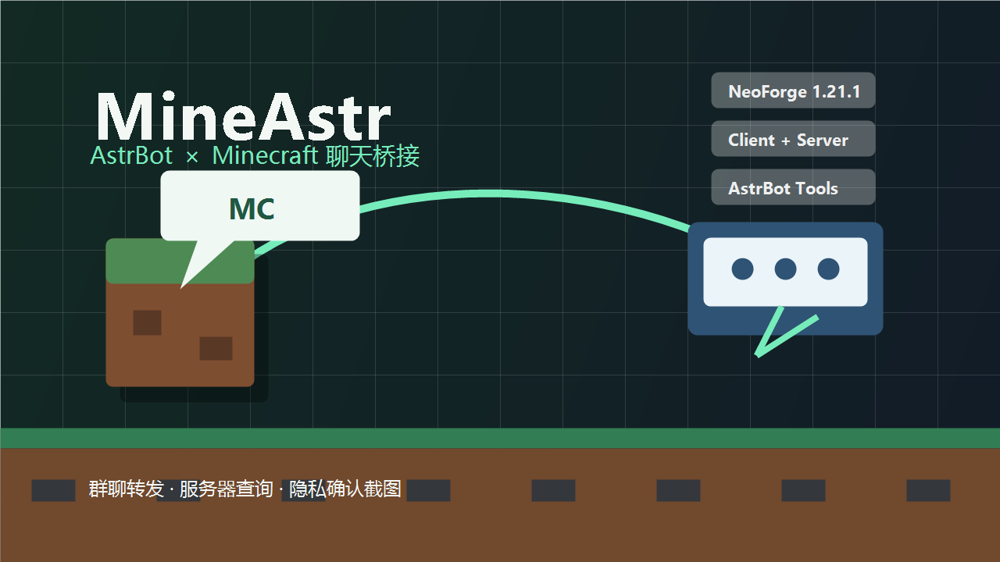

# MineAstr NeoForge Mod

[](#ai-制作声明)

> [!IMPORTANT]
> **AI 制作声明：本项目采用生成式 AI 参与设计、编码、UI 改进、文档编写与测试。** AI 生成或修改的内容由项目维护者审阅、验证并承担最终维护责任。



MineAstr 是一个 NeoForge 1.21.1 双端 Mod，用于把 Minecraft 聊天桥接到 AstrBot，把 AstrBot 的回复广播回游戏，并让 AI 理解服务器实际安装的 Mod、方块、物品和配方。

0.7 还会安全读取 Mod JAR 的 `zh_cn`/`en_us` 语言别名，使用配方 serializer codec 保留自定义加工结构，并提供可观测的重扫状态。

从 AstrBot 侧启用 MineAstr LLM 工具后，机器人还可以主动查询服务器状态、玩家状态、背包、附近实体和区域建筑特征，在严格鉴权后执行受控服务器命令，并在玩家客户端允许时请求低清晰度截图。

## 功能简介

- 把 Minecraft 里的普通聊天识别为 AstrBot 的同一个群聊。
- AstrBot 触发回复后，以 `[AstrBot] 回复内容` 的形式广播给全服。
- AstrBot 可以通过工具主动查询服务器状态、在线玩家、生命/位置、背包、附近实体和区域建筑特征。
- 服务器启动和数据包重载后会生成内容哈希快照，包含 Mod 元数据、注册物品/方块/实体/流体、标签与全部可枚举运行时配方。
- 可选的服务器命令工具默认关闭，启用后仍要求请求者可信名单和命令白名单同时匹配，并写入审计日志。
- 截图是可选客户端能力，默认会先询问玩家；玩家也可以改成自动发送或永不发送。
- 客户端配置页、截图授权页和本地世界服务端页使用 MineAstr 自定义原生界面，无需额外安装 Cloth Config 或 ModernUI。
- 单人世界的集成服务器桥接默认关闭，可在“本地服务端”页面通过 Switch 开关启用并配置地址、Token 和服务器标识。
- 服务端单独安装时，未安装客户端 Mod 的玩家仍可加入服务器，聊天和查询功能照常可用。

## 界面与运行环境确认

- **有配置界面**：安装在客户端后，可以在 NeoForge 的 Mod 列表中打开 MineAstr 配置界面，主要用于调整截图策略和截图大小/质量。
- **服务端无 GUI 可运行**：独立 NeoForge 服务端只读取 `config/mineastr-common.toml`，不需要也不会打开图形界面；Gradle 的 `runServer` 任务也已按 `--nogui` 配置。
- **服务端不强制客户端安装**：MineAstr 的客户端网络能力是可选的。没有安装客户端 Mod 的玩家可以进入服务器，但 AstrBot 对这些玩家请求截图时会返回“不支持截图”。
- **单人模式可选启用**：客户端安装 Mod 后，可在 MineAstr 配置页进入“本地服务端”，打开默认关闭的 Switch。开启后，单人世界的集成服务器才会连接 AstrBot；独立服务器不受此选项影响。

NeoForge 的 Mod 列表只读取 `logoFile` 作为图标，并没有单独的“封面图”元数据字段。本仓库提供 `cover.png` 作为发布页/README 封面，同时也把同一张图打包到资源目录 `assets/mineastr/textures/gui/cover.png`。

## 构建

请安装 JDK 21，然后运行：

```powershell
.\gradlew.bat build
```

构建产物位于 `build/libs/`。

## 安装与运行

独立服务器使用时，把构建出的 jar 放到 NeoForge 服务端的 `mods` 目录即可提供聊天桥接、状态查询和在线玩家查询。客户端没有安装 MineAstr 也可以加入服务器。

如果希望使用截图工具，目标玩家的客户端也需要安装同一个 MineAstr jar。截图是附加功能，不影响未安装客户端 Mod 的玩家进入服务器。

单人本地世界也可以使用：把 jar 放到 NeoForge 1.21.1 客户端的 `mods` 目录，在 Mod 列表打开 MineAstr 配置页，进入“本地服务端”并开启 Switch。该功能默认为关闭状态。

## 配置文件位置

首次启动游戏或服务器后，NeoForge 会生成 common 配置文件：

- 独立服务端：`服务端目录/config/mineastr-common.toml`
- 单人本地世界：`.minecraft/config/mineastr-common.toml`

客户端安装 MineAstr 后还会生成截图配置：

- 客户端：`.minecraft/config/mineastr-client.toml`

也可以在游戏主菜单的 Mod 列表中打开 MineAstr 的自定义配置界面修改截图选项。如果没有看到配置文件，请先确认服务端或客户端至少启动过一次，并且 MineAstr jar 已经放在正确的 `mods` 目录。

## 最简单配置

如果 AstrBot 和 Minecraft 在同一台电脑上，只需要改 `token`：

1. 在 AstrBot WebUI 的 `minecraft` 平台适配器里，把 `token` 改成一个随机字符串。
2. 打开 `mineastr-common.toml`。
3. 找到 `token = "change-me"`，把引号里的内容改成同一个随机字符串。
4. 保存文件，然后重启 Minecraft 服务器或客户端。

示例：

```toml
token = "mineastr-2026-xxxx"
```

## 完整配置示例

下面是 `mineastr-common.toml` 的完整示例。TOML 配置中，`#` 开头的是说明文字；真正生效的是 `=` 后面的值。字符串必须保留英文双引号。

仓库中也提供了同样内容的示例文件：[examples/mineastr-common.toml](examples/mineastr-common.toml)。

```toml
# 是否启用 MineAstr 并连接到 AstrBot。
# 不想转发聊天时改成 false。
enabled = true

# AstrBot minecraft 平台适配器的 WebSocket 地址。
# 本机运行 AstrBot 时通常保持 ws://127.0.0.1:8765/ws。
# AstrBot 在另一台机器时，把 127.0.0.1 改成那台机器的 IP 或域名。
websocketUrl = "ws://127.0.0.1:8765/ws"

# AstrBot 插件校验的 Bearer Token。
# 这里的值必须与 AstrBot minecraft 平台适配器中的 token 完全一致。
# 建议把 change-me 改成较长随机字符串，并同时填到 AstrBot 侧。
token = "change-me"

# 发送给 AstrBot 的稳定服务器 ID。
# 只有接入多个 Minecraft 服务器时才需要改；单服通常保持 minecraft。
serverId = "minecraft"

# 发送给 AstrBot 的服务器显示名称。
# 用于日志和识别，可以写成你的服务器名称。
serverName = "Minecraft 服务器"

# 独立服务器官网或介绍页；只允许 AstrBot 安全抓取公网 HTTPS 页面。
# 单人集成服务器会忽略该配置，且单人模式配置界面不会显示它。
serverIntroductionUrl = ""

# AstrBot 消息广播到 Minecraft 时显示的名称。
# 游戏内会显示为 [名称] 回复内容。
botDisplayName = "AstrBot"

# WebSocket 断开后的重连间隔，单位为秒。
# 网络不稳定时可以适当调大。
reconnectSeconds = 5

# 转发到 AstrBot 的单条玩家聊天最大长度。
# 超过这个长度的消息会被截断。
maxMessageLength = 1000

# 服务器公开事件推送；可分类关闭。
# 上下线包含玩家名和 UUID，死亡与成就不额外发送坐标。
enablePlayerPresencePush = true
enablePlayerDeathPush = true
enableAdvancementPush = true

# 是否扫描服务器 Mod、注册表、标签和运行时配方。
enableKnowledgeScan = true

# 玩家实时状态、背包、附近实体和区域建筑特征工具。
enablePlayerStateTool = true
enableInventoryTool = true
enableNearbyEntitiesTool = true
enableRegionTool = true
regionMaxBlocks = 32768

# 玩家活动地区统计、分析和原始数据保存期限。
enableActivityTracking = true
activitySampleSeconds = 60
environmentSampleMinutes = 30
enableAutomaticRegionFeatureScan = true
automaticRegionScanHorizontalRadius = 8
automaticRegionScanVerticalRadius = 6
activityAnalysisDays = 28
activityRetentionDays = 84
minimumRegionMinutes = 30
minimumRegionChunkMinutes = 2

# 首次加入简要告知。关闭或改写不会转移服务器提供者的责任。
enablePrivacyNotice = true
privacyNoticeText = "本服使用 MineAstr 统计活动与建筑特征；服务器还可运行 AI 玩家 Bot，并在服主显式启用后观察高信息量设备交互。普通聊天和公开事件也可转发给 AstrBot。不保存完整容器快照或完整建筑蓝图。使用 /mineastr privacy 查看详情，/mineastr tracking optout 与 /mineastr learning optout 可分别退出。"
privacyNoticeVersion = "4"

# 高风险命令工具默认关闭。
enableCommandTool = false
trustedCommandUsers = []
allowedCommandRules = ["list", "seed", "time query day", "time query daytime", "time query gametime"]
commandPermissionLevel = 4
commandMaxLength = 256
```

## 客户端截图配置

截图配置只在安装了客户端 Mod 的玩家电脑上生效。默认是 `ASK`，也就是 AstrBot 请求截图时先弹出确认窗口，玩家同意后才发送。

仓库中提供了示例文件：[examples/mineastr-client.toml](examples/mineastr-client.toml)。

```toml
# 是否让本地单人世界的集成服务器连接 AstrBot；默认关闭。
localWorldServerEnabled = false

# AstrBot 请求截图时客户端如何处理。
# ASK：弹出确认界面，玩家同意后发送；AUTO：自动发送；DISABLED：始终拒绝发送。
screenshotMode = "ASK"

# 发送给 AstrBot 的截图最大宽度。
screenshotMaxWidth = 1280

# 发送给 AstrBot 的截图最大高度。
screenshotMaxHeight = 720

# 截图 JPEG 质量，范围 0.10 到 0.95。
screenshotJpegQuality = 0.75

# 单张截图编码后的最大字节数。
screenshotMaxBytes = 1048576
```

## 跨机器部署

如果 AstrBot 和 Minecraft 服务器不在同一台机器上：

1. AstrBot 侧 `host` 建议填 `0.0.0.0`，`port` 和 `path` 可以保持默认。
2. Minecraft Mod 侧把 `websocketUrl` 改成 AstrBot 机器的 IP 或域名。
3. 确认 AstrBot 机器的防火墙放行对应端口，默认是 `8765`。

示例：

```toml
websocketUrl = "ws://192.168.1.20:8765/ws"
```

## 配置格式注意事项

- `enabled` 只能写 `true` 或 `false`，不要加引号。
- `localWorldServerEnabled` 只能写 `true` 或 `false`，默认是 `false`。
- `reconnectSeconds` 和 `maxMessageLength` 是数字，不要加引号。
- `websocketUrl`、`token`、`serverId`、`serverName`、`botDisplayName` 是字符串，必须保留英文双引号。
- `screenshotMode` 是字符串，只能写 `"ASK"`、`"AUTO"` 或 `"DISABLED"`。
- `screenshotJpegQuality` 是小数，不要加引号。
- 不要删除 `=`，不要把中文说明文字写到 `=` 后面。
- `websocketUrl` 的格式是 `ws://地址:端口/路径`，例如 `ws://127.0.0.1:8765/ws`。

## 服务端托管 AI 玩家 Agent

MineAstr 可以把版本锁定的 Mineflayer 与 pathfinder 依赖打进 Mod JAR，并由服务端 Mod 解压和监管独立 Node 子进程。Agent 控制端只监听 `127.0.0.1`，每次启动使用随机 Token；AstrBot 不会直接连接该内部端口。

0.10.1 默认使用 `agentSessionPolicy="on_demand"`：Node 控制进程保持本机待命，但 Mineflayer 不会仅因服务器启动或有人在线而登录。外部话题插件决定搭话并提交 `chat`，或 AstrBot 提交其他明确任务时，Bot 才会登录并在认证命令完成后执行；任务完成且不再有会话需求时，默认等待 `agentIdleDisconnectSeconds=60` 秒退出。`players_online` 会在存在至少一名非 MineAstr Bot 玩家或任务时保持在线，`always` 则保留旧版常驻行为。离线任务在登录阶段显示为 `waiting_for_connection`，90 秒仍无法入服会安全失败。

`agentNeoForgeCompatibility=true` 会在 Bot 连接同机地址时启用限定兼容层。服务端 Mod 从当前 NeoForge 运行时提取该服务器实际注册的必需频道、MineAstr 已实现确认的四个 NeoForge 核心配置握手频道，以及可由服务端在玩家进入世界后发送的可选 PLAY 频道，交给受监管的 Mineflayer 进程完成逐项协商。其他可选 CONFIGURATION 频道不会声明，避免触发 Mineflayer 无法确认的 Mod 专用配置任务；Mineflayer 不解析的 PLAY 自定义载荷会被安全忽略。它不会关闭或修改 NeoForge 对普通连接的全局校验；频道版本不一致时仍会失败并停止重连。已实测 NeoForge 21.1.219 + Create 6.0.9 可登录。

在这一“无客户端 Mod 过载”模式下，服务端动态注册的数据组件目前不能由 Mineflayer 的原版物品 codec 安全解码，因此背包全量/单槽同步会作为不透明数据跳过，状态中的 `degraded_mod_data` 会保持为 `true`。移动、观察、聊天和不依赖背包的任务仍可使用；自动进食和物品使用只有在后续加载了匹配服务器注册表的 codec 后才应视为可用，不能据此声称已完整支持 Mod 食品。

0.10.4 将私服二次认证正式纳入 Agent 就绪流程。如果服务器要求 `/login`，在 `config/mineastr-common.toml` 中配置：

```toml
agentJoinCommands = ["/login 请替换为专用Bot密码"]
agentJoinCommandDelayMs = 1000
agentJoinCommandSettleMs = 1500
```

Mineflayer 每次进入世界后会先等待 `agentJoinCommandDelayMs`，按顺序发送最多 5 条前置指令，再等待 `agentJoinCommandSettleMs`，之后才允许聊天、移动等 AI 任务开始。需要首次注册时可暂时改为 `agentJoinCommands = ["/register 密码 密码"]`，注册完成后再改回 `/login`；不要长期同时发送注册和登录命令。

普通服务器保持 `agentJoinCommands = []`。指令可能含有认证凭据并以明文保存在服务端 TOML 中，必须限制配置文件读取权限，也不要把真实密码粘贴到聊天、Issue 或日志。状态只返回配置数量、执行阶段、已发送数量和失败序号，不回显指令内容；某条指令在本地发送失败时，会阻止本次 AI 任务继续执行并以安全错误退出会话。

如果服务端安装了 Proxy Protocol Mod，并把 `127.0.0.1` 列为代理来源，同机 Agent 会在 Minecraft 握手前被要求发送 PROXY 头。此时设置 `agentProxyProtocol=true`；没有这类 Mod/代理时必须保持 `false`。MineAstr 只对同机 Agent 允许该选项，且状态工具会显示它是否生效。

> [!CAUTION]
> 兼容层会忽略 Mineflayer 无法解析的 Mod 自定义游戏数据，并跳过 Create 的自定义配方包（配方理解仍由 MineAstr 服务端知识快照/RAG 提供）。这可以保证本次实测组合上的登录、原版世界观察和基本动作，不等于完整 Create 客户端模拟。复杂机械结构的视觉与专用 GUI 操作仍需 with-mod 执行后端。

1. 在 Minecraft 服务端安装 Node.js 22 或更高版本。
2. 为 Bot 准备专用白名单身份。默认 `agentUseBotDisplayNameAsUsername=true`：Mod 优先采用 AstrBot 通过已认证 WebSocket 下发的显示名（例如 `Aria`），其次使用服务器显示名，都不符合 Minecraft 3–16 位英数下划线规则时才回退到 `agentUsername`。需要固定独立名称时关闭该开关。
3. 首次保持 `enableAgent=false` 启动，并用 `/mineastr agent status` 确认配置。
4. 设置正确的 `agentServerPort` 后启用 `enableAgent=true` 并重启服务端。

如果系统没有 Node，Agent 会安全禁用，聊天、知识快照、地区和事件功能不会受影响。`agentAutoDownloadNode=true` 可下载 MineAstr 固定版本；下载仅支持列入代码校验表的平台，并强制核对 SHA-256。默认不会联网安装 Node。

当前内置动作包括聊天、连续下蹲示好、移动到坐标/路径点、短时跟随玩家、看向坐标、交互方块、使用背包物品、等待以及手动/自动进食。`agentFullAutonomy=true` 时 AstrBot 可在类型白名单内自主调用；任务仍受单任务互斥、可取消执行、生命保护、维度/坐标检查、服务端禁区和请求者审计约束。路径点和 `walk`/`rail` 连接保存在当前世界的 `data/mineastr/agent/waypoints.json`，不会进入公共 RAG。

`agentCombatEnabled=true` 时，Agent 会周期检查 `agentCombatRadius` 内的明确敌对生物，在正常近战触及距离内选择背包中识别到的较优武器并按攻击冷却反击。该机制永不主动攻击玩家，并排除宠物、中立生物和可条件敌对的生物；苦力怕、监守者、凋灵和末影龙会触发撤退而不是迎战。生命值低于 `agentCombatMinHealth` 时同样优先撤退/进食；防卫时不会打断正在进行的挖掘、放置或物品使用。

0.10.2 的坐标与路径点移动不再直接信任上游 `goto()` 的 Promise：长距离会先用已知区块生成粗粒度 A* 走廊，再拼接为约 24 格的局部路段；每段及最终目标都校验 Bot 实际位置，连续无进展或总预算超时会返回目标、当前位置和剩余距离，不再误报完成。路径预算会按距离在 2–15 分钟间调整。

Agent 会把实际加载过的区块按每方块 2-bit 分类为空气、固体、水体或危险，并使用 deflate 持久化到 `world/data/mineastr/agent/navigation-cache/`。缓存不保存方块 ID、方块实体、NBT、容器、告示牌、玩家或聊天内容；索引只保留区块坐标、地表高度离散度和类别比例。默认最多 2048 个区块，超过后删除最旧项。方块变化会延迟刷新对应区块，缓存损坏或写入失败只会降级为直线分段，不会阻断 Agent。

0.10.3 起，`agentNavigationAllowDigging` 与 `agentNavigationAllowPlacing` 对新配置默认均为 `true`，使坐标/路径点寻路可像真实玩家一样挖掘挡路方块或消耗背包方块搭路。Mineflayer 会把挖掘、放置、液体和实体代价纳入 A*：挖掘成本还会结合当前背包中最佳工具、附魔、状态效果及方块实际挖掘时间；`agentNavigationDigCost=12` 对应 pathfinder 的 1x 基准倍率，避免普通树干因内部单步成本上限被误判为不可挖掘；放置会检查可识别的脚手材料并按 `agentNavigationPlaceCost` 惩罚。禁区对通行、挖掘和放置三者都生效，容器和常见机器/存储方块不会被自动挖掉。

NeoForge Mod 物品数据处于 `degraded_mod_data=true` 时不会假定存在材料，因此不会凭空规划放置。从 0.10.2 升级且配置文件已经保存了两个 `false` 的服务器需要由服主显式改为 `true`；MineAstr 不会擅自覆盖旧服务器的世界编辑选择。

Agent 状态会返回 `last_session_exit`、`last_death_at_ms` 和 `identity_change_pending`。因按需待机主动退出时，`last_session_exit.expected=true` 且 `code=idle_standby`；被踢出、登录超时或网络错误则会保留为非预期原因，避免 AI 再把正常待机误报为进程重启。

0.10.5 修复了任务只返回 `accepted=true` 就被上层误当作完成的问题。AstrBot 插件现在会追踪相同任务 ID，直到单个动作进入 `completed`、`failed` 或 `canceled`；服务端状态保留最近 10 个终态任务，避免极短任务被下一任务覆盖。任务恰好在闲置退出开始后到达时会标记为 `idle_disconnect_superseded`，断开后自动重连继续等待，不再把它表现成无任务待机。服务端 INFO 日志会记录任务 ID、类型、开始、终态和闲置前最后任务，但不记录动作参数或认证指令。

0.10.6 修复 Minecraft 1.21.x 下 Mineflayer 在树干/方块边界前可能长时停留的问题：引入碰撞边界兼容值、实际位移看门狗、分段超时、侧向恢复点和临时障碍成本，并在日志中输出路径状态与首个挖掘/放置动作。配置值 `agentNavigationDigCost=12` 现在正确对应 pathfinder 1x 基准，不再把徒手挖普通树干误判为不可行路径。任务终态事件改为紧凑审计记录，避免 observation 递归膨胀和 Java 端遗漏完成事件。同时新增可配置的敌对生物自主防卫：近战范围内自动选择武器并按冷却反击，低生命值或遇到苦力怕/监守者等高危实体时改为撤退，且不主动攻击玩家、宠物或中立生物。

完整模组客户端必须使用独立且经过验证的客户端实例目录，不能直接复制服务器 `mods`。状态工具会报告实例、可用物理内存与平均 MSPT 是否达到渲染门槛；8GB 主机默认要求至少剩余 3072MB 且 MSPT 健康。当前版本先提供运行时与熔断基座，未配置客户端实例时自动禁用 with-mod 渲染。

高信息量设备学习使用独立的 `enablePassiveSkillLearning` 开关，默认关闭。玩家可用 `/mineastr learning optout` 独立退出；该选择不影响活动地区统计。

## 命令

- `/mineastr status`：查看连接状态。
- `/mineastr reconnect`：主动断开当前连接并立即重连。
- `/mineastr privacy`：查看服务器提供者配置的简要数据告知和活动数据期限。
- `/mineastr tracking status|optout|optin`：查看、退出或重新加入活动地区统计；退出时删除仍可归属于该玩家的原始活动贡献。
- `/mineastr learning status|optout|optin`：查看、退出或重新加入高信息量设备技能学习。
- `/mineastr agent status`：管理员查看 Node、Agent、最近错误和渲染资源门槛。
- `/mineastr regions analyze-now`：管理员立即执行一次地区聚类分析。
- `/mineastr knowledge status`：查看本地扫描任务、快照 ID、各分类数量与最近错误。
- `/mineastr knowledge rescan`：提交一次异步扫描；已有任务时复用现有任务 ID。
- `/mineastr knowledge rescan-status`：查看最近重扫状态。

`status`、`reconnect`、`agent status`、`regions analyze-now` 和所有 `knowledge` 命令需要权限等级 2；隐私、tracking 和 learning 命令可由普通玩家使用。

## AstrBot 主动查询

Mod 支持 AstrBot 发来的 `query` 协议消息：

- `status`：返回服务器名称、Minecraft 版本、MineAstr Mod 版本、在线人数、最大人数、运行时长、世界出生点和在线玩家名。
- `players`：返回在线玩家数量、最大人数、在线玩家列表，以及每名玩家是否支持截图。
- `player_state`：返回指定在线玩家的生命、饥饿、护甲、位置、维度、游戏模式、经验和状态效果。
- `inventory`：返回指定玩家的快捷栏、背包、护甲、副手和可选末影箱摘要，不返回完整 NBT。
- `nearby_entities`：返回玩家附近实体的种类计数、距离、位置和生命摘要。
- `region_features`：分析已加载区域的方块调色板、门窗/楼梯/照明/容器/红石等部件、表面高度和粗略三维占用模型；不会强制加载新区块，也不读取容器内容、告示牌文字或方块实体 NBT。
- `command`：执行受控服务器命令。默认关闭；必须同时通过可信用户和命令规则检查，并记录请求者与命令审计日志。
- `screenshot`：向指定玩家客户端请求低清晰度截图。玩家未安装客户端 Mod、拒绝截图、禁用截图或超时时会返回失败原因。
- `knowledge_manifest`：返回当前知识快照 ID、生成时间和各分类记录数。
- `knowledge_page`：按快照 ID、分类和游标分页返回知识条目；快照变更时会拒绝混合新旧数据。
- `knowledge_status`：返回扫描启用状态、任务 ID、开始/完成时间、分类数量与经脱敏的最近错误。
- `knowledge_rescan`：提交 `local` 异步重扫；同时仅运行一个任务。
- `activity_regions_manifest` / `activity_regions_page`：返回按维度隔离、中心约 64 格精度的活动地区摘要，并可包含环境采样次数、疑似人工构造比例、建筑/机器特征计数和主要方块命名空间。逐点轨迹、精确边界和明文玩家 UUID 不会进入 AstrBot RAG。
- `agent_status`：即使 Agent 被禁用或缺少 Node 也返回可诊断状态，并报告会话策略、真人玩家数、唤醒原因和空闲退出时间。
- `agent_observe`：返回 Bot 的生命、饥饿、位置、背包、视线方块、简单视场方块及附近实体。
- `agent_task` / `agent_cancel`：提交或取消受类型约束的 Bot 任务；按需待机时任务会先唤醒 Bot，服务端继续执行自主模式、禁区和任务互斥检查。
- `agent_waypoints` / `transport_graph`：管理世界私有路径点以及步行/轨道连接。

扫描是只读的：不加载 Mod 代码，不读取玩家、世界存档、容器内容或方块实体 NBT。语言 JSON 受单文件 512 KiB、总计 4 MiB 和固定路径限制。自定义配方使用 Minecraft serializer codec 生成受深度、节点数与 512 KiB 限制的结构摘要；失败时仍保留 ID、type、serializer 并标记 `opaque`。

WebSocket 基础包仍兼容协议 1，并通过 `protocol_min=1`、`protocol_max=2`、`query_capabilities` 和可选 JSON 字段协商。MineAstr 0.4 客户端仍可连接 0.10 服务端；旧 AstrBot 插件会忽略新增 Agent 能力，仍可使用原有功能。

MineAstr 0.8 会以兼容的 `chat` 包推送 `message_kind=server_event`：`player_join`、`player_leave`、`player_death` 和 `player_advancement`。死亡和进度推送尊重 `showDeathMessages` 与 `announceAdvancements` 游戏规则；只推送会在游戏聊天中公开宣告的进度，不推送隐藏配方解锁。事件不含 IP 地址、精确坐标、背包或 NBT。

这些查询由 AstrBot 插件中的 LLM 工具触发。实际使用时，玩家可以直接问“我背包里还有多少火把”“附近有什么怪”“分析一下这栋房子的材料和结构”或“能看看我现在画面吗”，AstrBot 会在模型支持工具调用时主动查询 Mod，然后再组织回复。

## 服务器官网与活动地区

- `serverIntroductionUrl` 只在独立服务器握手时下发；为空则不联网抓取，单人集成服务器始终忽略。
- AstrBot 首先读取首页、`robots.txt` 和 sitemap，再从同源候选中选择页面。默认每周刷新，最多 12 页、总计 2 MiB、单页 512 KiB。
- 玩家位置每 60 秒按区块累计一次；默认每 30 分钟错峰选择一名在线玩家，在水平 8 格、垂直 6 格范围内采集方块调色板、人工构造比例与门窗、床、仓储、轨道、红石和 Create 机器等聚合特征。
- 自动环境采样只读已加载区块，不会强制加载新区块；不读取容器内容、告示牌文字、方块实体 NBT、精确建筑形状或完整蓝图。可用 `enableAutomaticRegionFeatureScan=false` 单独关闭。
- 原始数据按周存于主世界 `SavedData`，默认保留 84 天；每 28 天先保留活动至少 2 分钟的区块，再将同维度、相距不超过两个区块的候选聚类，聚类总活动至少 30 分钟才成为地区。
- AstrBot 依据聚合特征给出最多 3 个带置信度的候选类型，并立即把明确标记的 AI 未确认草稿加入 RAG；每次同步最多调用模型辅助排序 10 个变更草稿，最终文本始终由可重现的确定性模板组合，避免模型增加证据外事实。
- AstrBot 最多每天公开征集 3 个新地区的简介，窗口为 48 小时。包含对应地区编号的回复会进入候选；贡献玩家或 AstrBot 管理员优先，其他玩家的不冲突内容仍会保留。玩家或管理员已确认的简介不会被后续自动分析覆盖。

## 隐私、安全与合规（服务器提供者必读）

> [!WARNING]
> MineAstr 只提供技术开关和告知模板，不判断你的服务器适用哪一国家或地区的法律，也不保证“开启告知”即可自动合规。服务器提供者决定采集目的、配置 AI 服务和访问权限，并对告知、同意、未成年人、数据处理委托/跨境、玩家权利响应及安全事件承担责任。私人或邀请制服务器不必然自动免除这些责任；如有疑问请咨询适用地区的专业人士。

部署前至少完成以下事项：

1. 根据实际情况修改 `privacyNoticeText`，写明服务器提供者及联系方式、收集的数据、用途、保存期限、AI/Embedding 服务商与所在地、玩家如何查阅/删除/撤回，以及未成年人规则。
2. 决定是否开启 `enableActivityTracking`、`enableAutomaticRegionFeatureScan`、三类服务器事件推送、`enablePrivacyNotice`、普通聊天桥接、截图和各实时工具。关闭内置告知不会免除自行告知的责任。
3. 若改变告知内容，递增 `privacyNoticeVersion`，使所有玩家下次加入时再次看到。完整政策应放在服规或官网，简要告知不能替代必要的完整说明。
4. 确认你有权把官网页面、玩家明确提供的地区简介和其他内容放入知识库。官网中包含玩家名单、聊天记录或其他个人信息时，不应直接自动收录。
5. 不清楚模型、Embedding 或 RAG 数据在哪里处理、是否留存或用于训练时，优先使用本地服务，或关闭对应同步功能。

告知文本支持 `{server_name}`、`{retention_days}` 占位符和 `\n` 换行；这样修改实际保存期限后，简要告知可自动显示配置值。

活动退出会删除保留期内仍可归属于该玩家的原始区块贡献；已经形成且无法反向识别个人的聚合地区不会重算。地区贡献者只以服务器特定 SHA-256 匹配键发送到 AstrBot，RAG 文本不含玩家 UUID、精确轨迹或精确边界。普通 Minecraft 聊天以及已开启的上下线、死亡和公开成就事件会转发给 AstrBot；服主必须在告知中说明其用途和可能留存方式。`tracking optout` 只退出活动区块统计，不会隐藏这些公开服务器事件。

安全建议：两端使用长随机 Token；跨机器部署通过可信反向代理使用 `wss://`；限制世界存档、`data/mineastr/` 和备份的文件权限；只向必要管理员授予知识库、截图和玩家工具权限；制定备份恢复、删除请求和数据泄露响应流程。

## 受控服务器命令

命令工具采用拒绝优先设计，默认不可用。启用时至少完成下面四项：

1. 把 `enableCommandTool` 改成 `true`。
2. 确认两端 `token` 已从默认的 `change-me` 改成安全随机字符串；弱 token 下命令工具会拒绝执行。
3. 在 `trustedCommandUsers` 填入可信人员的 Minecraft UUID、玩家名或 AstrBot 用户 ID；推荐 UUID。
4. 在 `allowedCommandRules` 配置允许规则。普通条目只允许完全相同的命令；`"say *"` 允许 `say` 及其参数；单独 `"*"` 会允许所有命令，风险极高。

例如只允许玩家 Alice 查询时间和执行带参数的 `say`：

```toml
enableCommandTool = true
trustedCommandUsers = ["Alice", "00000000-0000-0000-0000-000000000000"]
allowedCommandRules = ["time query daytime", "say *"]
```

所有通过工具执行的命令都会以 WARN 级别记录请求者和命令。LLM 无法从工具参数自行指定请求者身份；AstrBot 插件会从真实事件上下文附带身份，Mod 再做最终鉴权。

## AI 制作声明

MineAstr 在开发过程中使用了 OpenAI Codex 等生成式 AI 能力，参与范围包括：

- Java、Python 与配置代码的生成、修改和重构。
- 客户端配置界面、截图授权界面及交互文案设计。
- 崩溃风险、线程安全、网络边界与命令权限的辅助审查。
- README、双语文本、配置示例和故障排查文档编写。
- Gradle 构建、客户端/服务端启动及 WebSocket 协议测试流程。

AI 输出不代表天然正确或安全。所有合并到仓库的内容均应由维护者人工审阅，并通过适当的编译、运行和安全测试后再用于生产服务器。

英文声明：*This project was created with assistance from generative AI, including OpenAI Codex. AI-assisted changes remain subject to human review, testing, and maintainer responsibility.*

## 故障排查

- 状态一直是 `未连接`：确认 AstrBot 已启动，`minecraft` 平台适配器已启用，`websocketUrl` 指向正确地址。
- 日志中出现 `401` 或认证失败：检查两端 `token` 是否完全一致。
- 玩家聊天没有进入 AstrBot：确认 `enabled = true`，并检查服务器日志中是否有连接失败或 JSON 错误。
- 玩家上下线、死亡或成就没有进入 AstrBot：确认对应的 `enable*Push` 开关和 AstrBot 侧 `server_event_push_enabled` 已开启。
- 游戏里没有看到回复：AstrBot 是否回复由 AstrBot 自身的群聊规则、唤醒词和权限决定。
- AstrBot 不会查询在线玩家：确认 AstrBot 当前模型支持工具调用，并且插件与 Mod 都已经更新到支持查询协议的版本。
- AstrBot 请求截图失败：确认目标玩家客户端安装了 MineAstr，并且 `screenshotMode` 不是 `"DISABLED"`。默认 `"ASK"` 模式下，玩家需要在弹窗里点击“发送截图”。
- 单人世界没有连接 AstrBot：打开 Mod 列表中的 MineAstr 配置页，进入“本地服务端”，确认 Switch 已开启且 WebSocket 地址和 Token 正确。
